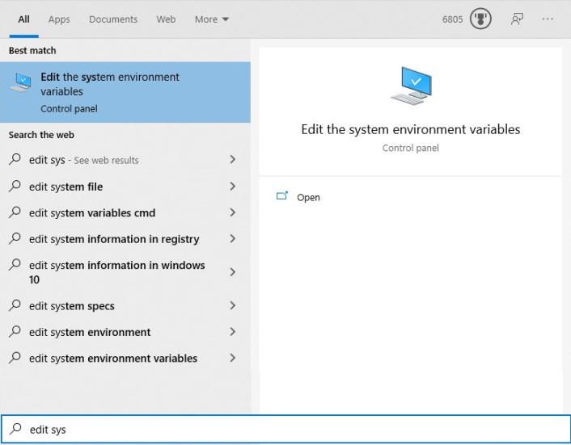
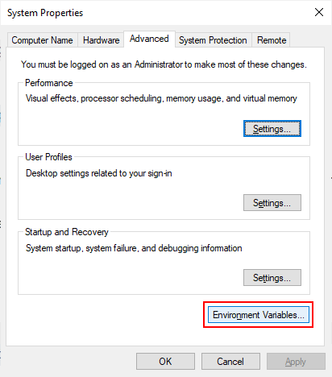
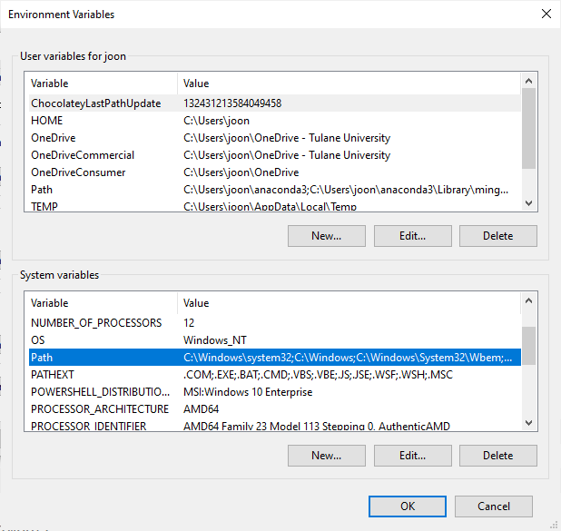
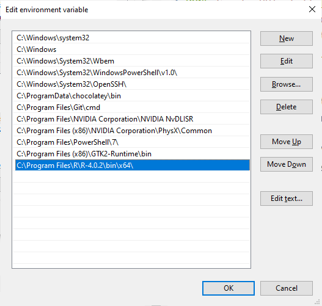

.. title: Installing rpy2 in Windows 10
.. slug: install-rpy2-windows-10
.. date: 2020/08/31 10:00
.. tags: python, windows, installation, rpy2, R
.. link: 
.. description: My Powershell Customizations
.. type: text
.. author: Joon Ro
.. category: Windows

I recently had to install rpy2 for a project and I found it now has become
much easier to install it in Windows environment (basically you can just use
``pip install rpy2``)

I'm posting this I can refer to it later --- hopefully it is useful for others
as well.

The software versions I'm using are:

- Python 3.8.3 installed via ``Anaconda3-2020.07-Windows-x86_64.exe``

- R 4.0.2 via ``R-4.0.2-win.exe``

  - I did use ``Save version number in registry`` option during the
    installation, which was checked by default. See the discussion below for
    potential issues of not using this option.

You can first install ``rpy2`` via pip:

.. code:: sh

    > pip install rpy2

Now if you try to import ``rpy2`` in python, for example using ``import rpy2.robjects as robjects``, you will get the following error:

.. code:: python

    OSError: cannot load library 'C:\Program Files\R\R-4.0.2\bin\x64\R.dll': error 0x7e

Generally in Windows, dll errors can be solved by adding the path to it to
your ``PATH`` environmental variable.  In the start menu, search for ``Edit the system environmental variables`` and run it: 

You can click on ``Environmental Variables``:

There, you can click on the ``Path`` System variable, 

and add ``C:\Program Files\R\R-4.0.2\bin\x64\``:

(Obviously, if you are using different versions of R, you have to change the
version number part of the path accordingly).

That is it. Comparing to `the experience I had several years ago <https://stackoverflow.com/a/25630406/439325>`_, it is now
much more convenient.  You can check the installation by:

.. code:: python

    import rpy2
    for row in rpy2.situation.iter_info():
        print(row)

which gave me:

.. code:: python

    rpy2 version:
    3.3.5
    Python version:
    3.8.3 (default, Jul  2 2020, 17:30:36) [MSC v.1916 64 bit (AMD64)]
    Looking for R's HOME:
        Environment variable R_HOME: None
        InstallPath in the registry: C:\Program Files\R\R-4.0.2
        Environment variable R_USER: None
        Environment variable R_LIBS_USER: None
    R version:
        In the PATH: 
        Loading R library from rpy2: OK
    Additional directories to load R packages from:
    None
    C extension compilation:
        Warning: Unable to get R compilation flags.

So it does look like it relies on ``InstallPath in the registry`` to identify
the location of R installation.  So if you did not add the item to the
registry, you can add an environmental variable called ``R_HOME``, with
``C:\Program Files\R\R-4.0.2``.
