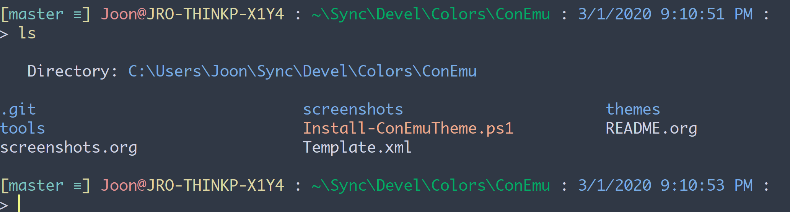

.. title: My PowerShell Customizations
.. slug: powershell-customizations
.. date: 2016/02/10 16:00
.. tags: PowerShell, windows, settings, posh, git
.. link: 
.. description: My Powershell Customizations
.. type: text
.. author: Joon Ro
.. category: Windows

I describe my customizations for PowerShell. With these, my PowerShell
terminal looks like the following screenshot. Not only these customizations
make it look great, but also they make me productive in the command line in
Windows.

ConEmu
------

I use ConEmu as my terminal emulator. ConEmu provides tabbed sessions,
changing color schemes on-the-fly, and many customization options. 

Color Themes
~~~~~~~~~~~~

The screenshots are taken with ``moe-dark theme``. ConEmu comes with many color
schemes, and I also maintain a github repository which contains my favorite
color themes for ConEmu. You can check it out at <Put link here>

Prompt Customization
--------------------

git
~~~

To get git-related information on your prompt, you should get
``posh-git``. Then, you can show the git-related information with the following:

.. code-block:: powershell

    Import-Module posh-git

    # customize git prompt display settings
    $global:GitPromptSettings.BeforeText = '['
    $global:GitPromptSettings.AfterText = '] '
    $global:GitPromptSettings.BranchAheadForegroundColor = [ConsoleColor]::Green
    $global:GitPromptSettings.WorkingForegroundColor = [ConsoleColor]::Magenta
    $global:GitPromptSettings.UntrackedForegroundColor = [ConsoleColor]::DarkGray

    Enable-GitColors

where the item names are self-explanatory.

``prompt`` function
~~~~~~~~~~~~~~~~~~~

Now you can set-up a function called ``prompt`` and put whatever information you
want there with color settings. My current setup is the following:

.. code-block:: powershell

    # http://serverfault.com/questions/95431
    function Test-Administrator {
        $user = [Security.Principal.WindowsIdentity]::GetCurrent();
        (New-Object Security.Principal.WindowsPrincipal $user).IsInRole([Security.Principal.WindowsBuiltinRole]::Administrator)
    }

    function prompt {
        $realLASTEXITCODE = $LASTEXITCODE

        Write-Host

        # Reset color, which can be messed up by Enable-GitColors
        $Host.UI.RawUI.ForegroundColor = $GitPromptSettings.DefaultForegroundColor

        if (Test-Administrator) {  # Use different username if elevated
            Write-Host "(Elevated) " -NoNewline -ForegroundColor White
        }

        Write-Host "$ENV:USERNAME@" -NoNewline -ForegroundColor DarkYellow
        Write-Host "$ENV:COMPUTERNAME" -NoNewline -ForegroundColor Magenta

        if ($s -ne $null) {  # color for PSSessions
            Write-Host " (`$s: " -NoNewline -ForegroundColor DarkGray
            Write-Host "$($s.Name)" -NoNewline -ForegroundColor Yellow
            Write-Host ") " -NoNewline -ForegroundColor DarkGray
        }

        Write-Host " : " -NoNewline -ForegroundColor DarkGray
        Write-Host $($(Get-Location) -replace "C:\\Users\\Joon", "~") -NoNewline -ForegroundColor Blue
        Write-Host " : " -NoNewline -ForegroundColor DarkGray
        Write-Host (Get-Date -Format G) -NoNewline -ForegroundColor DarkMagenta
        Write-Host " : " -NoNewline -ForegroundColor DarkGray

        $global:LASTEXITCODE = $realLASTEXITCODE

        Write-VcsStatus

        Write-Host ""

        return "> "
    }

You want to replace ``C:\\Users\\Joon`` with your own path, of course. Also I
have additional things for ``PSSessions`` (the block starting with ``if ($s -ne $null) { # color for PSSessions``), which you can safely remove (or just leave
it there).

Color coding ``Get-ChildItem``
------------------------------

To color-code the results of ``Get-ChildItem``, I use my own
`Get-ChildItem-Color <https://github.com/joonro/Get-ChildItem-Color>`_. Once you download it, you can set aliases to it:

.. code-block:: powershell

    # Color coded ls
    . "$ScriptPath\Get-ChildItem-Color\Get-ChildItem-Color.ps1"

    Set-Alias l Get-ChildItem-Color -option AllScope
    Set-Alias ls Get-ChildItem-Format-Wide -option AllScope

    function Get-ChildItem-Force { l -Force }
    set-alias la Get-ChildItem-Force -option AllScope

so you have ``l``, ``ls``, and ``la``.

Note that I have the following on top of my PowerShell script so I can refer
to the script path easily with ``$ScriptPath``, and I put ``Get-ChildItem-Color``
under ``~\Documents\WindowsPowerShell``. You can modify the path obviously.

.. code-block:: powershell

    $ScriptPath = Split-Path -parent $PSCommandPath

PSReadLine
----------

`PSReadLine <https://github.com/lzybkr/PSReadLine>`_ makes PowerShell to behave like ``zsh``, which is my favorite shell
in GNU/Linux. It gives you substring history search, incremental history
search, and awesome tab-completion. The following is my current setup:

.. code-block:: powershell

    Import-Module PSReadLine

    Set-PSReadLineOption -HistoryNoDuplicates
    Set-PSReadLineOption -HistorySearchCursorMovesToEnd
    Set-PSReadLineOption -HistorySaveStyle SaveIncrementally
    Set-PSReadLineOption -MaximumHistoryCount 4000
    # history substring search
    Set-PSReadlineKeyHandler -Key UpArrow -Function HistorySearchBackward
    Set-PSReadlineKeyHandler -Key DownArrow -Function HistorySearchForward

    # Tab completion
    Set-PSReadlineKeyHandler -Chord 'Shift+Tab' -Function Complete
    Set-PSReadlineKeyHandler -Key Tab -Function MenuComplete

With these settings, I can press up and down arrows for history substring
search, and the tab completion shows me available candidates. For example:

.. image:: ../images/posh_PSReadLine_tab_completion.png

You can also press ``CTRL+R`` for incremental history search.

Others
------

``cddash``
~~~~~~~~~~

You can use the following to have the "dash" functionality - namely, you can go
back to the previous location by typing ``cd -``. It is from
`http://goo.gl/xRbYbk <http://goo.gl/xRbYbk>`_.

.. code-block:: powershell

    function cddash {
        if ($args[0] -eq '-') {
            $pwd = $OLDPWD;
        } else {
            $pwd = $args[0];
        }
        $tmp = pwd;

        if ($pwd) {
            Set-Location $pwd;
        }
        Set-Variable -Name OLDPWD -Value $tmp -Scope global;
    }

    Set-Alias -Name cd -value cddash -Option AllScope

Boost startup speed
~~~~~~~~~~~~~~~~~~~

If you feel it takes a lot of time to start a PowerShell session due to your
profile script, I found running the following (I saved it as ``ngen.ps1``) in an
elevated PowerShell helps a lot.

.. code-block:: powershell

    $env:path = [Runtime.InteropServices.RuntimeEnvironment]::GetRuntimeDirectory()
    [AppDomain]::CurrentDomain.GetAssemblies() | % {
      if (! $_.location) {continue}
      $Name = Split-Path $_.location -leaf
      Write-Host -ForegroundColor Yellow "NGENing : $Name"
      ngen install $_.location | % {"`t$_"}
    }

Source: `http://stackoverflow.com/questions/4208694/ <http://stackoverflow.com/questions/4208694/>`_.
