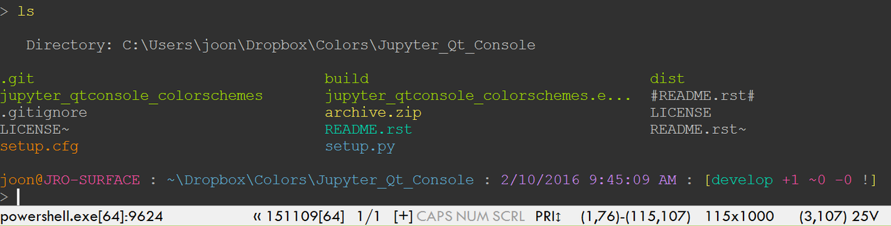
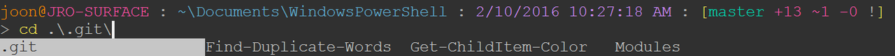

.. title: My PowerShell Customizations
.. slug: powershell-customizations
.. date: 2020/03/01 16:00
.. tags: PowerShell, windows, settings, posh, git
.. link: 
.. description: My Powershell Customizations
.. type: text
.. author: Joon Ro
.. category: Windows

I describe my customizations for PowerShell. With these, my PowerShell
terminal looks like the following screenshot. Not only these customizations
make it look great, but also they make me productive in the command line in
Windows.

ConEmu
------

I use ConEmu as my terminal emulator. ConEmu provides tabbed sessions,
changing color schemes on-the-fly, and many customization options. 

Color Themes
~~~~~~~~~~~~

The screenshots are taken with ``moe-dark theme``. ConEmu comes with many color
schemes, and I also maintain a github repository which contains my favorite
color themes for ConEmu. You can check out the `GitHub <https://github.com/joonro/ConEmu-Color-Themes>`_ repository.

posh-git and prompt customization
---------------------------------

.. note::

    The current customization is for posh-git 0.7.x. posh-git 1.0.0 uses
    a different way of customization. 

To get git-related information on your prompt, you should get `posh-git <https://github.com/dahlbyk/posh-git>`_. Then,
you can show the git-related information along with other useful information
by modifying ``prompt()`` function. For example:

.. code:: powershell

    # http://serverfault.com/questions/95431
    function Test-Administrator {
        $user = [Security.Principal.WindowsIdentity]::GetCurrent();
        (New-Object Security.Principal.WindowsPrincipal $user).IsInRole([Security.Principal.WindowsBuiltinRole]::Administrator)
    }

    function prompt {
        # https://github.com/dahlbyk/posh-git/wiki/Customizing-Your-PowerShell-Prompt
        $origLastExitCode = $LastExitCode
        Write-VcsStatus

        if (Test-Administrator) {  # if elevated
            Write-Host "(Elevated) " -NoNewline -ForegroundColor White
        }

        Write-Host "$env:USERNAME@" -NoNewline -ForegroundColor Red
        Write-Host "$env:COMPUTERNAME" -NoNewline -ForegroundColor Yellow
        Write-Host " : " -NoNewline -ForegroundColor DarkGray

        $curPath = $ExecutionContext.SessionState.Path.CurrentLocation.Path
        if ($curPath.ToLower().StartsWith($Home.ToLower()))
        {
            $curPath = "~" + $curPath.SubString($Home.Length)
        }

        Write-Host $curPath -NoNewline -ForegroundColor Green
        Write-Host " : " -NoNewline -ForegroundColor DarkGray
        Write-Host (Get-Date -Format G) -NoNewline -ForegroundColor Blue
        Write-Host " : " -NoNewline -ForegroundColor DarkGray
        $LastExitCode = $origLastExitCode
        "`n$('>' * ($nestedPromptLevel + 1)) "
    }

    Import-Module posh-git

    $global:GitPromptSettings.BeforeText = '['
    $global:GitPromptSettings.AfterText  = '] '

Color coding ``Get-ChildItem``
------------------------------

To color-code the results of ``Get-ChildItem``, I use my own
`Get-ChildItemColor <https://github.com/joonro/Get-ChildItemColor>`_. Once you install it, you can set aliases to the exposed functions:

.. code:: powershell

    If (-Not (Test-Path Variable:PSise)) {  # Only run this in the console and not in the ISE
        Import-Module Get-ChildItemColor
    
        Set-Alias l Get-ChildItemColor -option AllScope
        Set-Alias ls Get-ChildItemColorFormatWide -option AllScope
    }

so you have colored versions of ``l`` and ``ls`` equivalents.

PSReadLine
----------

`PSReadLine <https://github.com/lzybkr/PSReadLine>`_ makes PowerShell to behave like ``zsh``, which is my favorite shell
in GNU/Linux. It gives you substring history search, incremental history
search, and awesome tab-completion. The following is my current setup:

.. code:: powershell

    Import-Module PSReadLine

    Set-PSReadLineOption -HistoryNoDuplicates
    Set-PSReadLineOption -HistorySearchCursorMovesToEnd
    Set-PSReadLineOption -HistorySaveStyle SaveIncrementally
    Set-PSReadLineOption -MaximumHistoryCount 4000
    # history substring search
    Set-PSReadlineKeyHandler -Key UpArrow -Function HistorySearchBackward
    Set-PSReadlineKeyHandler -Key DownArrow -Function HistorySearchForward

    # Tab completion
    Set-PSReadlineKeyHandler -Chord 'Shift+Tab' -Function Complete
    Set-PSReadlineKeyHandler -Key Tab -Function MenuComplete

With these settings, I can press up and down arrows for history substring
search, and the tab completion shows me available candidates. For example:

You can also use ``CTRL + r`` for incremental history search.

Others
------

``cddash``
~~~~~~~~~~

You can use the following to have the "dash" functionality - namely, you can go
back to the previous location by typing ``cd -``. It is from
`http://goo.gl/xRbYbk <http://goo.gl/xRbYbk>`_.

.. code:: powershell

    function cddash {
        if ($args[0] -eq '-') {
            $pwd = $OLDPWD;
        } else {
            $pwd = $args[0];
        }
        $tmp = pwd;

        if ($pwd) {
            Set-Location $pwd;
        }
        Set-Variable -Name OLDPWD -Value $tmp -Scope global;
    }

    Set-Alias -Name cd -value cddash -Option AllScope

Boost startup speed
~~~~~~~~~~~~~~~~~~~

If you feel it takes a lot of time to start a PowerShell session due to your
profile script, I found running the following (I saved it as ``ngen.ps1``) in an
elevated PowerShell helps a lot.

.. code:: powershell

    $env:path = [Runtime.InteropServices.RuntimeEnvironment]::GetRuntimeDirectory()
    [AppDomain]::CurrentDomain.GetAssemblies() | % {
      if (! $_.location) {continue}
      $Name = Split-Path $_.location -leaf
      Write-Host -ForegroundColor Yellow "NGENing : $Name"
      ngen install $_.location | % {"`t$_"}
    }

Source: `http://stackoverflow.com/questions/4208694/ <http://stackoverflow.com/questions/4208694/>`_.

Changelog
---------

[2020-03-01 Sun]
    - Add a note that current prompt customization is for ``posh-git`` version 0.7.x.

[2017-04-22 Sat]
    - Update prompt customization script for the latest version of ``posh-git``
      (0.7.2)

    - Update ``Git-ChildItemColor`` related information

[2017-01-03 Tue]
    - Update prompt customization script for the latest version of ``posh-git``
