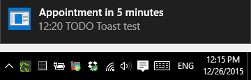
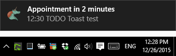

.. title: Native desktop (toast) notifications for org-mode appointments in Windows
.. slug: toast-notifications-org-mode-windows
.. date: 
.. tags: howto, setting, emacs, org-mode, windows, toast
.. link: 
.. description: org file for my blog
.. type: text
.. author: Joon Ro
.. category: Emacs

I describe how to set up native desktop notifications (Toast notifications)
for org-mode appointments in Windows 8+.

Install ``toast``
-----------------

I use ``toast.exe`` from toaster project: `https://github.com/nels-o/toaster <https://github.com/nels-o/toaster>`_. You
can ``git clone`` the whole repo which includes the executable:

.. code-block:: posh

    > git clone https://github.com/nels-o/toaster.git

Emacs Settings
--------------

The following is pretty much the same to
`https://lists.gnu.org/archive/html/emacs-orgmode/2013-02/msg00644.html <https://lists.gnu.org/archive/html/emacs-orgmode/2013-02/msg00644.html>`_. You
can modify ``appt-message-warning-time`` and ``appt-display-interval`` to your need:

.. code-block:: scheme

    (require 'appt)
    (setq appt-time-msg-list nil)    ;; clear existing appt list
    (setq appt-display-interval '5)  ;; warn every 5 minutes from t - appt-message-warning-time
    (setq
      appt-message-warning-time '15  ;; send first warning 15 minutes before appointment
      appt-display-mode-line nil     ;; don't show in the modeline
      appt-display-format 'window)   ;; pass warnings to the designated window function
    (appt-activate 1)                ;; activate appointment notification
    (display-time)                   ;; activate time display

    (org-agenda-to-appt)             ;; generate the appt list from org agenda files on emacs launch
    (run-at-time "24:01" 3600 'org-agenda-to-appt)           ;; update appt list hourly
    (add-hook 'org-finalize-agenda-hook 'org-agenda-to-appt) ;; update appt list on agenda view

Next, specify the path to your ``toast`` executable (note that I'm using
UNIX-style path here, seems to be working well):

.. code-block:: scheme

    (defvar toast-notifier-path 
      "/home/joon/Programs/toast/bin/Release/toast"
      )

Set up the call to ``toast``:

.. code-block:: scheme

    ;; set up the call to the notifier
    (defun toast-appt-send-notification (title msg)
      (shell-command (concat toast-notifier-path
                             " -t \"" title "\""
                             " -m \"" msg "\"")))

    ;; designate the window function for my-appt-send-notification
    (defun toast-appt-display (min-to-app new-time msg)
      (toast-appt-send-notification 
        (format "Appointment in %s minutes" min-to-app)    ;; passed to -t in toast call
        (format "%s" msg)))                                ;; passed to -m in toast call

    (setq appt-disp-window-function (function toast-appt-display))

Now Emacs will use ``toast`` to notify you of upcoming appointments:

If you want to be fancier, you can show an icon in the notification as
well. You can download an icon (from
`http://www.easyicon.net/language.en/540985-org_mode_icon.html <http://www.easyicon.net/language.en/540985-org_mode_icon.html>`_, for example)
and modify ``toast-appt-send-notification`` by adding ``-p`` argument (you have
to use Windows-style path here):

.. code-block:: scheme

    ;; set up the call to the notifier
    (defun toast-appt-send-notification (title msg)
      (shell-command (concat toast-notifier-path
                             " -t \"" title "\""
                             " -m \"" msg "\""
                             " -p C:\\Users\\joon\\Programs\\Assets\\Icons\\org_mode_256px_540985_easyicon.net.png")))

which makes notifications look very nice:

